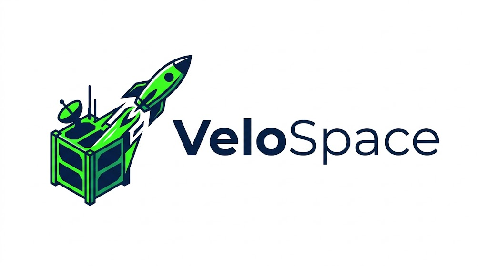
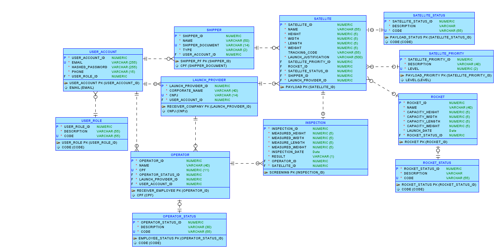
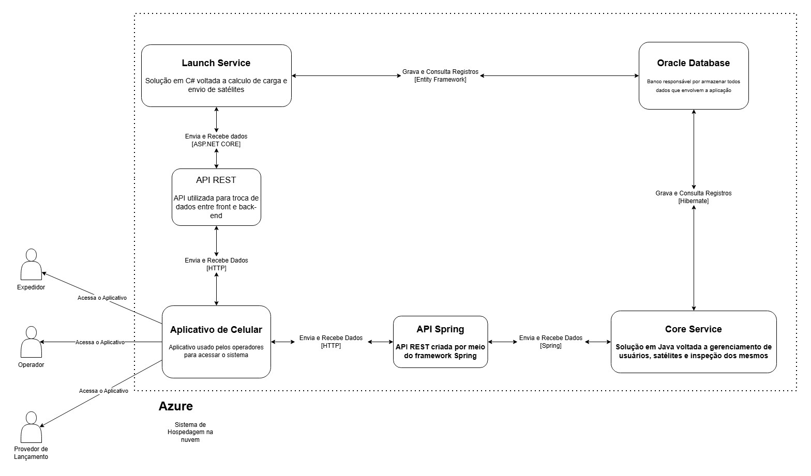

# VeloSpace: Plataforma de Gestão e Validação de CubeSats

## Definição do Projeto

### O que é o VeloSpace?

O **VeloSpace** é uma plataforma digital desenvolvida para conectar proprietários de **CubeSats**, como universidades, instituições de pesquisa e desenvolvedores independentes, a empresas fornecedoras de serviços de lançamento espacial.

O projeto surgiu da necessidade de reduzir a burocracia e a dificuldade encontradas por organizações que desejam colocar pequenos satélites em órbita, aproveitando oportunidades de lançamento frequentemente subutilizadas pelas empresas do setor aeroespacial.

A proposta do VeloSpace é tornar o processo de candidatura, seleção, rastreabilidade e validação de CubeSats mais **digital, transparente, seguro e eficiente**.

---

## Objetivo do Projeto

O escopo do projeto contempla:

- Publicação de oportunidades de lançamento por fornecedores;
- Cadastro de CubeSats pelos usuários;
- Processo de candidatura dos satélites às oportunidades disponíveis;
- Realização de sorteios para definição dos participantes selecionados;
- Geração de QR Codes para rastreabilidade dos CubeSats sorteados;
- Validação automatizada das dimensões dos satélites durante sua recepção na base de lançamento.

Durante o cadastro, os proprietários informam as características técnicas e dimensões de seus CubeSats. Após o envio do satélite à empresa responsável pelo lançamento, a equipe da base realiza novas medições e registra os valores obtidos no sistema.

Por meio da leitura do QR Code, o VeloSpace recupera os dados originalmente cadastrados e realiza uma comparação automática entre as informações declaradas e as medições efetuadas. Caso sejam identificadas divergências, o CubeSat é removido do processo de integração ao foguete. Caso contrário, ele é aprovado para prosseguir para as próximas etapas.

Esse mecanismo aumenta a transparência, reduz a possibilidade de erros operacionais e contribui para a integridade do processo de validação.

> O sistema não contempla o transporte físico dos CubeSats, concentrando-se na gestão, rastreabilidade e validação das informações necessárias para garantir um processo mais transparente, seguro e eficiente.

---

## 🏗️ Arquitetura e Tecnologias

A solução .NET da VeloSpace foi desenvolvida como uma **API RESTful** utilizando **.NET 9 Web API**, com persistência em **Oracle Database** por meio do **Entity Framework Core**.

### Tecnologias utilizadas

- **Backend:** .NET 9 Web API
- **Banco de Dados:** Oracle Database
- **ORM:** Entity Framework Core com Oracle Provider
- **Autenticação:** JWT Bearer Token
- **Documentação:** Swagger / OpenAPI
- **Logging:** Serilog
- **Monitoramento:** Health Checks e HealthChecks UI
- **Testes:** xUnit, Moq e FluentAssertions
- **Containerização:** Docker

### Arquitetura em camadas

A API segue uma arquitetura em camadas, com separação clara entre:

- **Model / Domain Model:** entidades que representam as tabelas do banco Oracle.
- **Repositories:** camada de acesso a dados com Entity Framework Core.
- **Services:** camada de regras de negócio, validações e tratamento de exceções.
- **Controllers:** endpoints REST responsáveis por receber requisições e retornar respostas HTTP.
- **DTOs:** objetos utilizados para transporte de dados entre cliente e API.
- **Context:** configuração do `DbContext` da aplicação.

Estrutura geral:

```txt
VeloSpace
├── Context
├── Controllers
├── DTOs
├── Model
├── Repositories
├── Services
├── Program.cs
├── appsettings.json
└── Dockerfile
```

---

## 🤝 Integrantes do Projeto

| Nome | Função no Projeto | LinkedIn | GitHub |
|---|---|---|---|
| Cleyton Enrike de Oliveira | Desenvolvedor .NET & IOT & DBA | [LinkedIn](https://www.linkedin.com/in/cleyton-enrike-de-oliveira99) | [@Cleytonrik99](https://github.com/Cleytonrik99) |
| Matheus Henrique Nascimento de Freitas | Desenvolvedor Mobile & DBA | [LinkedIn](https://www.linkedin.com/in/matheus-henrique-freitas) | [@MatheusHenriqueNF](https://github.com/MatheusHenriqueNF) |
| Pedro Henrique Sena | Desenvolvedor Java & DevOps | [LinkedIn](https://www.linkedin.com/in/pedro-henrique-sena) | [@devpedrosena1](https://github.com/devpedrosena1) |
| Paulo Sérgio França Barbosa | Desenvolvedor Java & DevOps & DBA | [LinkedIn](https://www.linkedin.com/in/paulosergiofb/) | [@PauloSergioFIAP](https://github.com/PauloSergioFIAP) |
| Enzo Ribeiro Vilela de Azevedo | Quality Assurance | [LinkedIn](https://www.linkedin.com/in/enzo-de-azevedo/) | [@enzorva](https://github.com/enzorva) |

---

## Escopo

O VeloSpace será desenvolvido como uma solução para gestão de oportunidades de lançamento espacial, cadastro de usuários e validação de CubeSats.

### Funcionalidades principais

1. **Gestão de usuários e autenticação**
   - Cadastro de contas de usuário.
   - Login via JWT.
   - Perfis de usuários por função.

2. **Gestão de Shippers**
   - Cadastro de proprietários/remetentes de CubeSats.
   - Associação do Shipper a uma conta de usuário.
   - Consulta, atualização, exclusão e busca paginada.

3. **Gestão de Launch Providers**
   - Cadastro de empresas fornecedoras de lançamento.
   - Associação do Launch Provider a uma conta de usuário.
   - Consulta, atualização, exclusão e busca paginada.

4. **Gestão de Operators**
   - Cadastro de operadores vinculados a fornecedores de lançamento.
   - Associação com status de operador e conta de usuário.
   - Consulta, atualização, exclusão e busca paginada.

5. **Gestão de Rockets**
   - Cadastro de foguetes.
   - Associação com status do foguete.
   - Registro automático da data de cadastro/lançamento.
   - Consulta, atualização, exclusão e busca paginada.

6. **Gestão de Satellites**
   - Consulta de satélites cadastrados.
   - Associação com Shipper, Launch Provider, Rocket, Status e Prioridade.
   - Apoio ao processo de rastreabilidade e validação.

7. **Monitoramento e observabilidade**
   - Health Checks da aplicação.
   - Health Check do banco Oracle.
   - HealthChecks UI.
   - Logging estruturado com Serilog.

8. **Testes automatizados**
   - Testes com xUnit.
   - Mocks com Moq.
   - Validações com FluentAssertions.
   - Organização dos testes seguindo o padrão AAA.

---

## Requisitos Funcionais e Não Funcionais

### Requisitos Funcionais

1. Cadastro e autenticação de usuários.
2. Cadastro de Shippers.
3. Cadastro de Launch Providers.
4. Cadastro de Operators.
5. Cadastro e consulta de Rockets.
6. Consulta de Satellites.
7. Busca com filtros, paginação e ordenação.
8. Geração de respostas HTTP adequadas para sucesso, erro, conflito e não encontrado.
9. Monitoramento da saúde da aplicação.
10. Execução de testes automatizados.

### Requisitos Não Funcionais

- **Segurança:** autenticação baseada em JWT Bearer Token.
- **Manutenibilidade:** arquitetura em camadas.
- **Observabilidade:** logging estruturado e health checks.
- **Escalabilidade:** separação entre controllers, services, repositories e DTOs.
- **Confiabilidade:** tratamento de exceções e validações de regras de negócio.
- **Testabilidade:** uso de testes automatizados com mocks.

---

# 📡 API VeloSpace — Endpoints e Exemplos

> Por padrão, a API roda localmente em **http://localhost:5000**

> Link de deploy: **https://csharp-rm560442.azurewebsites.net/swagger/index.html**

---

## 🔐 Auth — `/api/Auth`

| Método | Endpoint | Descrição | Corpo da Requisição | Resposta Esperada |
|---|---|---|---|---|
| **POST** | `/api/Auth/login` | Realiza login e retorna token JWT. | Exemplo abaixo. | 200 OK com token ou 401 Unauthorized. |

### Exemplo de corpo para **POST** `/api/Auth/login`

```json
{
  "email": "usuario@email.com",
  "hashedPassword": "Senha123"
}
```

### Exemplo de resposta de sucesso

```json
{
  "token": "jwt_token_gerado_pela_api",
  "userAccountId": 1,
  "email": "usuario@email.com",
  "phone": "11999998888",
  "userRoleId": 1
}
```

### Como usar o token no Swagger

Após realizar o login, copie o token retornado e clique no botão **Authorize** do Swagger.

Informe o token no formato:

```txt
Bearer seu_token_aqui
```

A autenticação utiliza:

- Validação de `Issuer`;
- Validação de `Audience`;
- Validação do tempo de expiração;
- Validação da chave de assinatura;
- Senha validada com **BCrypt**.

---

## 📦 Shipper — `/api/Shipper`

O Shipper representa o proprietário/remetente de um CubeSat.

| Método | Endpoint | Descrição | Corpo da Requisição | Resposta Esperada |
|---|---|---|---|---|
| **GET** | `/api/Shipper` | Retorna todos os Shippers cadastrados. | — | 200 OK com coleção de Shippers. |
| **GET** | `/api/Shipper/{id}` | Retorna um Shipper pelo ID. | — | 200 OK ou 404 Not Found. |
| **POST** | `/api/Shipper` | Cadastra um novo Shipper e sua conta de usuário. | Exemplo abaixo. | 201 Created, 400 Bad Request ou 409 Conflict. |
| **PUT** | `/api/Shipper/{id}` | Atualiza os dados principais de um Shipper. | Exemplo abaixo. | 200 OK, 400 Bad Request ou 404 Not Found. |
| **DELETE** | `/api/Shipper/{id}` | Remove um Shipper pelo ID. | — | 200 OK ou 404 Not Found. |
| **GET** | `/api/Shipper/search` | Busca Shippers com filtros, paginação e ordenação. | — | 200 OK com resultado paginado. |

> Observação: o endpoint `POST /api/Shipper` permite acesso anônimo. Os demais endpoints exigem token JWT.

### Exemplo de corpo para **POST** `/api/Shipper`

```json
{
  "shipperDto": {
    "name": "Cliente Remetente LTDA",
    "shipperDocument": "12345678912345",
    "type": "PJ"
  },
  "userAccountDto": {
    "email": "shipper@email.com",
    "hashedPassword": "Senha123",
    "phone": "11999998888",
    "userRoleId": 1
  }
}
```

### Exemplo de corpo para **PUT** `/api/Shipper/{id}`

```json
{
  "name": "Cliente Remetente Atualizado LTDA",
  "shipperDocument": "98765432112345",
  "type": "PJ"
}
```

### Exemplos de busca

```http
GET http://localhost:5000/api/Shipper/search?name=Cliente&type=PJ&page=1&pageSize=10&sortBy=shipperId&sortDir=asc
```

Parâmetros suportados:

- `name` *(string, opcional)* — filtra pelo nome do Shipper;
- `type` *(string, opcional)* — filtra pelo tipo, por exemplo `PF` ou `PJ`;
- `page` *(int, padrão: 1)* — página atual;
- `pageSize` *(int, padrão: 10)* — quantidade de itens por página;
- `sortBy` *(string, padrão: shipperId)* — campo de ordenação;
- `sortDir` *(string, padrão: asc)* — direção da ordenação.

---

## 🚀 LaunchProvider — `/api/LaunchProvider`

O Launch Provider representa a empresa fornecedora de serviços de lançamento espacial.

| Método | Endpoint | Descrição | Corpo da Requisição | Resposta Esperada |
|---|---|---|---|---|
| **GET** | `/api/LaunchProvider` | Retorna todos os fornecedores cadastrados. | — | 200 OK com coleção. |
| **GET** | `/api/LaunchProvider/{id}` | Retorna um fornecedor pelo ID. | — | 200 OK ou 404 Not Found. |
| **POST** | `/api/LaunchProvider` | Cadastra um novo fornecedor e sua conta de usuário. | Exemplo abaixo. | 201 Created, 400 Bad Request ou 409 Conflict. |
| **PUT** | `/api/LaunchProvider/{id}` | Atualiza os dados principais do fornecedor. | Exemplo abaixo. | 200 OK, 400 Bad Request ou 404 Not Found. |
| **DELETE** | `/api/LaunchProvider/{id}` | Remove um fornecedor pelo ID. | — | 200 OK ou 404 Not Found. |
| **GET** | `/api/LaunchProvider/search` | Busca fornecedores com filtros, paginação e ordenação. | — | 200 OK com resultado paginado. |

> Observação: o endpoint `POST /api/LaunchProvider` permite acesso anônimo. Os demais endpoints exigem token JWT.

### Exemplo de corpo para **POST** `/api/LaunchProvider`

```json
{
  "launchProviderDto": {
    "corporateName": "Space Launch Brasil LTDA",
    "cnpj": "12345678912345"
  },
  "userAccountDto": {
    "email": "launch.provider@email.com",
    "hashedPassword": "Senha123",
    "phone": "11999998888",
    "userRoleId": 2
  }
}
```

### Exemplo de corpo para **PUT** `/api/LaunchProvider/{id}`

```json
{
  "corporateName": "Space Launch Brasil Atualizada LTDA",
  "cnpj": "98765432112345"
}
```

### Exemplos de busca

```http
GET http://localhost:5000/api/LaunchProvider/search?corporateName=Space&cnpj=12345678912345&page=1&pageSize=10&sortBy=launchProviderId&sortDir=asc
```

Parâmetros suportados:

- `corporateName` *(string, opcional)* — filtra pela razão social;
- `cnpj` *(string, opcional)* — filtra pelo CNPJ;
- `page` *(int, padrão: 1)*;
- `pageSize` *(int, padrão: 10)*;
- `sortBy` *(string, padrão: launchProviderId)*;
- `sortDir` *(string, padrão: asc)*.

---

## 👷 Operator — `/api/Operator`

O Operator representa o operador responsável por executar atividades ligadas ao fornecedor de lançamento.

| Método | Endpoint | Descrição | Corpo da Requisição | Resposta Esperada |
|---|---|---|---|---|
| **GET** | `/api/Operator` | Retorna todos os operadores cadastrados. | — | 200 OK com coleção. |
| **GET** | `/api/Operator/{id}` | Retorna um operador pelo ID. | — | 200 OK ou 404 Not Found. |
| **POST** | `/api/Operator` | Cadastra um novo operador e sua conta de usuário. | Exemplo abaixo. | 201 Created, 400 Bad Request ou 409 Conflict. |
| **PUT** | `/api/Operator/{id}` | Atualiza os dados principais do operador. | Exemplo abaixo. | 200 OK, 400 Bad Request ou 404 Not Found. |
| **DELETE** | `/api/Operator/{id}` | Remove um operador pelo ID. | — | 200 OK ou 404 Not Found. |
| **GET** | `/api/Operator/search` | Busca operadores com filtros, paginação e ordenação. | — | 200 OK com resultado paginado. |

> Observação: o endpoint `POST /api/Operator` permite acesso anônimo. Os demais endpoints exigem token JWT.

### Exemplo de corpo para **POST** `/api/Operator`

```json
{
  "operatorDto": {
    "name": "Carlos Operador",
    "cpf": "12345678901",
    "operatorStatusId": 1,
    "launchProviderId": 1
  },
  "userAccountDto": {
    "email": "carlos.operador@email.com",
    "hashedPassword": "Senha123",
    "phone": "11999998888",
    "userRoleId": 3
  }
}
```

### Exemplo de corpo para **PUT** `/api/Operator/{id}`

```json
{
  "name": "Carlos Operador Atualizado",
  "cpf": "12345678901",
  "operatorStatusId": 1,
  "launchProviderId": 1
}
```

### Exemplos de busca

```http
GET http://localhost:5000/api/Operator/search?name=Carlos&cpf=12345678901&operatorStatusId=1&launchProviderId=1&page=1&pageSize=10&sortBy=operatorId&sortDir=asc
```

Parâmetros suportados:

- `name` *(string, opcional)* — filtra pelo nome do operador;
- `cpf` *(string, opcional)* — filtra pelo CPF do operador;
- `operatorStatusId` *(long, opcional)*;
- `launchProviderId` *(long, opcional)*;
- `page` *(int, padrão: 1)*;
- `pageSize` *(int, padrão: 10)*;
- `sortBy` *(string, padrão: operatorId)*;
- `sortDir` *(string, padrão: asc)*.

> Observação: o CPF é tratado como `string` para preservar os 11 dígitos e evitar perda de zeros à esquerda.

---

## 🛰️ Rocket — `/api/Rocket`

O Rocket representa o foguete utilizado nas oportunidades/processos de lançamento.

| Método | Endpoint | Descrição | Corpo da Requisição | Resposta Esperada |
|---|---|---|---|---|
| **GET** | `/api/Rocket` | Retorna todos os foguetes cadastrados. | — | 200 OK com coleção. |
| **GET** | `/api/Rocket/{id}` | Retorna um foguete pelo ID. | — | 200 OK ou 404 Not Found. |
| **POST** | `/api/Rocket` | Cadastra um novo foguete. | Exemplo abaixo. | 201 Created ou 400 Bad Request. |
| **PUT** | `/api/Rocket/{id}` | Atualiza um foguete existente. | Exemplo abaixo. | 200 OK, 400 Bad Request ou 404 Not Found. |
| **DELETE** | `/api/Rocket/{id}` | Remove um foguete pelo ID. | — | 200 OK ou 404 Not Found. |
| **GET** | `/api/Rocket/search` | Busca foguetes com filtros, paginação e ordenação. | — | 200 OK com resultado paginado. |

### Exemplo de corpo para **POST** `/api/Rocket`

```json
{
  "name": "Falcon Test",
  "capacityHeight": 70,
  "capacityWidth": 12,
  "capacityLength": 30,
  "capacityWeight": 500,
  "rocketStatusId": 1
}
```

> O campo `launchDate` é preenchido automaticamente pela aplicação no momento do cadastro.

### Exemplo de corpo para **PUT** `/api/Rocket/{id}`

```json
{
  "name": "Falcon Test Atualizado",
  "capacityHeight": 75,
  "capacityWidth": 13,
  "capacityLength": 32,
  "capacityWeight": 550,
  "rocketStatusId": 1
}
```

### Exemplos de busca

```http
GET http://localhost:5000/api/Rocket/search?name=Falcon&capacityHeight=70&capacityWidth=12&capacityLength=30&capacityWeight=500&rocketStatusId=1&page=1&pageSize=10&sortBy=rocketId&sortDir=asc
```

Parâmetros suportados:

- `name` *(string, opcional)* — filtra pelo nome do foguete;
- `capacityHeight` *(int, opcional)*;
- `capacityWidth` *(int, opcional)*;
- `capacityLength` *(int, opcional)*;
- `capacityWeight` *(int, opcional)*;
- `rocketStatusId` *(long, opcional)*;
- `page` *(int, padrão: 1)*;
- `pageSize` *(int, padrão: 10)*;
- `sortBy` *(string, padrão: rocketId)*;
- `sortDir` *(string, padrão: asc)*.

---

## 🛰️ Satellite — `/api/Satellite`

O Satellite representa o CubeSat cadastrado no sistema.

| Método | Endpoint | Descrição | Corpo da Requisição | Resposta Esperada |
|---|---|---|---|---|
| **GET** | `/api/Satellite/{id}` | Retorna um satélite específico pelo ID. | — | 200 OK ou 404 Not Found. |

### Exemplo

```http
GET http://localhost:5000/api/Satellite/1
```

---

## 🔍 Paginação, filtros e ordenação

Os endpoints de busca da API retornam resultados paginados para facilitar a navegação e melhorar a performance em consultas com muitos registros.

Exemplo de estrutura de resposta paginada:

```json
{
  "items": [
    {
      "id": 1,
      "name": "Exemplo"
    }
  ],
  "pageInfo": {
    "page": 1,
    "pageSize": 10,
    "totalItems": 1,
    "totalPages": 1
  }
}
```

Parâmetros comuns:

- `page` — página atual;
- `pageSize` — quantidade de itens por página;
- `sortBy` — campo utilizado para ordenação;
- `sortDir` — direção da ordenação, podendo ser `asc` ou `desc`.

---

## 🔧 Configurações adicionadas na API .NET

A solução .NET possui as seguintes configurações no `Program.cs`:

- Registro do `VeloSpaceContext` com Oracle via Entity Framework Core;
- Injeção de dependência para repositories e services;
- Configuração de autenticação JWT Bearer;
- Configuração de Swagger com suporte a Bearer Token;
- Inclusão de documentação XML no Swagger;
- Configuração de CORS com a política `AllowAll`;
- Configuração de Health Checks para aplicação e banco Oracle;
- Configuração do HealthChecks UI;
- Configuração de logging estruturado com Serilog.

### Exemplo complementar de configuração no `appsettings.json`

```json
{
  "ConnectionStrings": {
    "DefaultConnection": "User Id=USUARIO;Password=SENHA;Data Source=HOST:PORTA/SERVICO"
  },
  "Jwt": {
    "Key": "CHAVE_SECRETA_FORTE_PARA_ASSINATURA_DO_TOKEN",
    "Issuer": "VeloSpaceApi",
    "Audience": "VeloSpaceClient"
  },
  "Serilog": {
    "Using": [ "Serilog.Sinks.Console", "Serilog.Sinks.File" ],
    "MinimumLevel": {
      "Default": "Information"
    },
    "WriteTo": [
      {
        "Name": "Console"
      },
      {
        "Name": "File",
        "Args": {
          "path": "Logs/log-development-.txt",
          "rollingInterval": "Day"
        }
      }
    ]
  }
}
```

---

## ❤️ Monitoramento e Observabilidade

A solução .NET do VeloSpace possui recursos de monitoramento e observabilidade para acompanhamento da saúde da aplicação, conectividade com banco de dados e rastreamento de requisições.

### Health Checks disponíveis

| Endpoint | Descrição |
|---|---|
| **GET** `/health` | Retorna o status geral da aplicação, incluindo verificações registradas. |
| **GET** `/health/application` | Retorna o status interno da aplicação, validando se a API está em execução. |
| **GET** `/health/database` | Retorna o status da conectividade com o banco de dados Oracle. |
| **GET** `/health-ui` | Interface visual para monitoramento dos Health Checks configurados. |

### Como monitorar a aplicação

- **Health Check geral:** `http://localhost:5000/health`
- **Health Check da aplicação:** `http://localhost:5000/health/application`
- **Health Check do banco:** `http://localhost:5000/health/database`
- **Painel visual dos Health Checks:** `http://localhost:5000/health-ui`

### Logging estruturado

A aplicação utiliza **Serilog** para logging estruturado, registrando eventos relevantes com níveis de severidade apropriados:

- **Information** para requisições bem-sucedidas;
- **Warning** para respostas da faixa 4xx;
- **Error** para exceções e respostas da faixa 5xx.

Os logs são exibidos no terminal e também podem ser gravados em arquivo dentro da pasta `Logs`.

---

## 🗃️ Diagrama de Entidade-Relacionamento (DER)

<div align="center">
  
</div>

---

## Diagrama de Arquitetura
<div align="center">
  
</div>

---

## 🐳 Docker

A solução possui suporte para execução via Docker.

### Build da imagem

```bash
docker build -t velospace-api .
```

### Executar container

```bash
docker run -p 5000:8080 --name velospace-api velospace-api
```

Após iniciar o container, acesse:

```txt
http://localhost:5000/swagger
```

> Observação: caso utilize Docker, garanta que as configurações sensíveis, como connection string e chave JWT, sejam fornecidas de forma segura por variáveis de ambiente ou arquivos de configuração apropriados.

---

## ⚙️ Como Rodar o Projeto

### Pré-requisitos

1. **.NET 9.0 SDK**
2. **Oracle Database**
3. **Entity Framework Core com Oracle Provider**
4. **Visual Studio, Rider ou VS Code**
5. **Docker** *(opcional)*

---

### 🚀 Executando o projeto localmente

1. **Clone o repositório**

```bash
git clone https://github.com/Cleytonrik99/VeloSpace-DotNet.git
cd VeloSpace-DotNet
```

2. **Restaure as dependências**

```bash
dotnet restore
```

3. **Compile o projeto**

```bash
dotnet build
```

4. **Configure a conexão com o banco**

No `appsettings.json`, configure:

```json
{
  "ConnectionStrings": {
    "DefaultConnection": "User Id=USUARIO;Password=SENHA;Data Source=HOST:PORTA/SERVICO"
  }
}
```

5. **Execute o servidor**

Entre na pasta do projeto da API, onde está o arquivo `.csproj`, e rode:

```bash
dotnet run
```

> Importante: execute o projeto a partir da pasta correta para garantir que o `appsettings.json` seja carregado corretamente.

6. **Acesse o Swagger**

```txt
http://localhost:5000/swagger
```

7. **Acesse os endpoints de monitoramento**

```txt
http://localhost:5000/health
http://localhost:5000/health/application
http://localhost:5000/health/database
http://localhost:5000/health-ui
```

---

## 🧪 Como Executar os Testes

A solução conta com testes automatizados para validar regras de negócio e comportamento dos endpoints da API.

### Tecnologias utilizadas nos testes

- **xUnit**
- **Moq**
- **FluentAssertions**
- **Microsoft.NET.Test.Sdk**

### Padrão AAA

Os testes seguem o padrão **AAA (Arrange, Act, Assert)**:

- **Arrange:** preparação dos dados, mocks e dependências necessárias;
- **Act:** execução do método que está sendo testado;
- **Assert:** validação do resultado esperado.

### Executar todos os testes

Na raiz da solution, rode:

```bash
dotnet test
```

### Fluxo recomendado

```bash
dotnet restore
dotnet build
dotnet test
```

### Estrutura dos testes

```txt
VeloSpaceTest
└── Controllers
    ├── AuthControllerTests.cs
    ├── LaunchProviderControllerTests.cs
    ├── OperatorControllerTests.cs
    ├── RocketControllerTests.cs
    └── ShipperControllerTests.cs
```

### Cenários testados

Os testes contemplam cenários como:

- Login válido retornando `200 OK`;
- Login inválido retornando `401 Unauthorized`;
- Busca por ID retornando `200 OK`;
- Busca por ID inexistente retornando `404 Not Found`;
- Cadastro válido retornando `201 Created`;
- Cadastro com conflito retornando `409 Conflict`.

### Nomenclatura dos testes

Os testes seguem o formato:

```txt
MetodoTestado_Cenario_ResultadoEsperado
```

Exemplo:

```txt
Login_WhenCredentialsAreValid_ShouldReturnOk
GetById_WhenRocketDoesNotExist_ShouldReturnNotFound
AddShipper_WhenEmailAlreadyExists_ShouldReturnConflict
```

### Exemplo de teste automatizado

```csharp
[Fact]
public async Task GetById_WhenRocketDoesNotExist_ShouldReturnNotFound()
{
    // Arrange
    var rocketId = 999L;

    _rocketServiceMock
        .Setup(service => service.GetByIdAsync(rocketId))
        .ThrowsAsync(new RocketService.NotFoundException($"Rocket with id {rocketId} not found"));

    // Act
    var result = await _rocketController.GetById(rocketId);

    // Assert
    result.Should().BeOfType<NotFoundObjectResult>();
}
```

---

## 📚 Documentação da API

A API utiliza Swagger/OpenAPI para documentação dos endpoints.

Para que os comentários XML apareçam corretamente no Swagger, o projeto deve possuir no `.csproj`:

```xml
<PropertyGroup>
  <GenerateDocumentationFile>true</GenerateDocumentationFile>
  <NoWarn>$(NoWarn);1591</NoWarn>
</PropertyGroup>
```

E no `Program.cs`:

```csharp
var xmlFile = $"{Assembly.GetExecutingAssembly().GetName().Name}.xml";
var xmlPath = Path.Combine(AppContext.BaseDirectory, xmlFile);

if (File.Exists(xmlPath))
{
    options.IncludeXmlComments(xmlPath);
}
```

Após rodar a aplicação, acesse:

```txt
http://localhost:5000/swagger
```

---

## 📌 Observações importantes

- Os endpoints protegidos exigem autenticação via JWT.
- Os endpoints de cadastro de `Shipper`, `LaunchProvider` e `Operator` permitem acesso anônimo para viabilizar registro inicial.
- O campo `launchDate` do `Rocket` é preenchido automaticamente no cadastro.
- As senhas recebidas no cadastro são armazenadas utilizando hash com BCrypt.
- O sistema não realiza transporte físico dos CubeSats.
- A solução não possui integração com Azure Monitor/OpenTelemetry nesta versão.
- Recomenda-se não versionar arquivos com dados sensíveis, como connection strings reais e chaves JWT.
